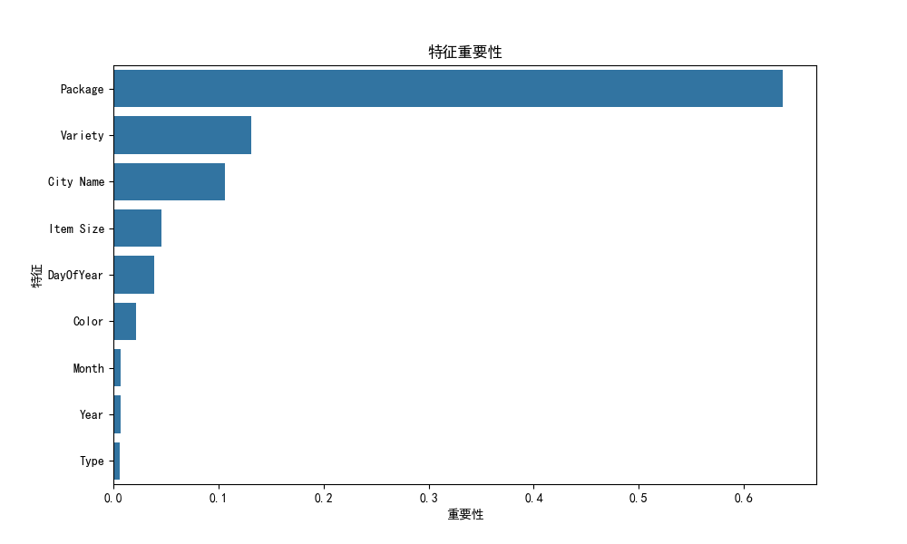
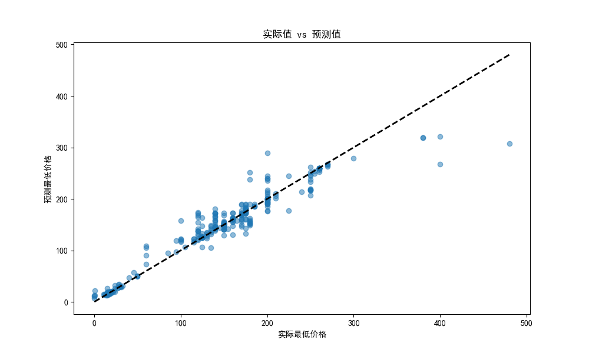
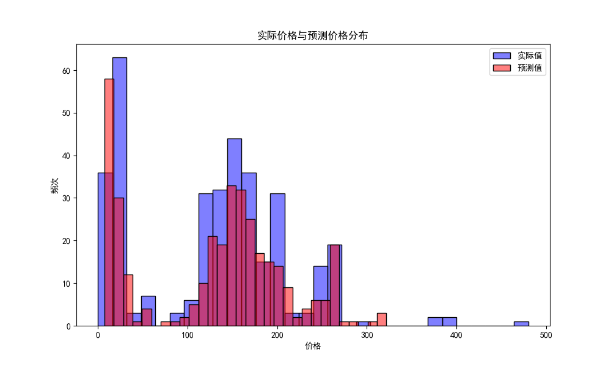
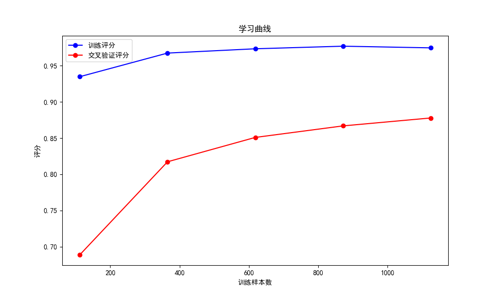

# 美国南瓜价格预测

## 项目简介

本项目旨在基于美国南瓜销售数据，利用随机森林回归模型预测南瓜的最低价格。通过对数据的预处理、特征工程和模型训练，实现了较为准确的价格预测，并通过可视化手段展示了模型的性能和特征的重要性。

## 数据集

数据集包含以下字段：

- **City Name**：城市名称
- **Type**：类型
- **Package**：包装
- **Variety**：品种
- **Date**：日期
- **Item Size**：尺寸
- **Color**：颜色
- **Low Price**：最低价格
- **Year**：年份（由日期提取）
- **Month**：月份（由日期提取）
- **DayOfYear**：一年中的第几天（由日期提取）

## 代码分析

### 数据预处理

1. **读取数据**
   ```python
   data = pd.read_csv('US-pumpkins.csv')
   ```
   使用 pandas 读取 `US-pumpkins.csv` 数据文件。

2. **填充缺失值**
   ```python
   data.fillna(method='ffill', inplace=True)
   ```
   使用前向填充（`ffill`）处理缺失值。

3. **日期转换**
   ```python
   data['Date'] = pd.to_datetime(data['Date'])
   data['Year'] = data['Date'].dt.year
   data['Month'] = data['Date'].dt.month
   data['DayOfYear'] = data['Date'].dt.dayofyear
   ```
   将日期列转换为 datetime 格式，并提取年、月和一年中的第几天作为新特征。

4. **特征编码**
   ```python
   for col in ['City Name', 'Type', 'Package', 'Variety', 'Color']:
       le = LabelEncoder()
       data[col] = data[col].astype(str)
       data[col] = le.fit_transform(data[col])
   ```
   对分类变量进行编码，将其转换为数值形式。

5. **特殊值映射**
   ```python
   size_mapping = {
       'sml': 0,
       'med': 1,
       'xlge': 2,
       'jbo': 3,
       'med-lge': 4,
       'lge': 5,
       'exjbo': 6,
       'xtra': 7
   }
   data['Item Size'] = data['Item Size'].map(size_mapping).fillna(-1).astype(int)
   ```
   将特殊值映射为数值，便于模型处理。

### 模型训练与评估

1. **特征选择与目标变量**
   ```python
   features = ['City Name', 'Type', 'Package', 'Variety', 'Year', 'Month', 'DayOfYear', 'Item Size', 'Color']
   X = data[features]
   y = data['Low Price']
   ```
   选择关键特征和目标变量（最低价格）。

2. **数据集划分**
   ```python
   X_train, X_test, y_train, y_test = train_test_split(X, y, test_size=0.2, random_state=42)
   ```
   将数据集划分为训练集和测试集。

3. **特征缩放**
   ```python
   scaler = StandardScaler()
   X_train_scaled = scaler.fit_transform(X_train)
   X_test_scaled = scaler.transform(X_test)
   ```
   对特征进行标准化处理。

4. **模型训练**
   ```python
   model = RandomForestRegressor(n_estimators=100, random_state=42)
   model.fit(X_train_scaled, y_train)
   ```
   使用随机森林回归模型进行训练。

5. **模型评估**
   ```python
   y_pred = model.predict(X_test_scaled)
   mse = mean_squared_error(y_test, y_pred)
   r2 = r2_score(y_test, y_pred)
   ```
   计算均方误差（MSE）和决定系数（R²）以评估模型性能。

6. **特征重要性**
   ```python
   importances = model.feature_importances_
   feature_importance = pd.Series(importances, index=features)
   feature_importance = feature_importance.sort_values(ascending=False)
   ```
   提取并排序特征重要性。

### 可视化代码

1. **特征重要性**
   ```python
   plt.figure(figsize=(10, 6))
   sns.barplot(x=feature_importance.values, y=feature_importance.index)
   plt.title('特征重要性')
   plt.xlabel('重要性')
   plt.ylabel('特征')
   plt.show()
   ```
   可视化特征的重要性。

2. **实际值与预测值对比**
   ```python
   plt.figure(figsize=(10, 6))
   plt.scatter(y_test, y_pred, alpha=0.5)
   plt.plot([min(y_test), max(y_test)], [min(y_test), max(y_test)], 'k--', lw=2)
   plt.xlabel('实际最低价格')
   plt.ylabel('预测最低价格')
   plt.title('实际值 vs 预测值')
   plt.show()
   ```
   可视化实际值与预测值的对比。

3. **价格分布**
   ```python
   plt.figure(figsize=(10, 6))
   sns.histplot(y_test, bins=30, color='blue', alpha=0.5, label='实际值')
   sns.histplot(y_pred, bins=30, color='red', alpha=0.5, label='预测值')
   plt.title('实际价格与预测价格分布')
   plt.xlabel('价格')
   plt.ylabel('频次')
   plt.legend()
   plt.show()
   ```
   可视化实际价格与预测价格的分布。

4. **学习曲线**
   ```python
   train_sizes, train_scores, test_scores = learning_curve(
       model, X_train_scaled, y_train, train_sizes=np.linspace(.1, 1.0, 5), cv=5
   )
   train_scores_mean = np.mean(train_scores, axis=1)
   test_scores_mean = np.mean(test_scores, axis=1)

   plt.figure(figsize=(10, 6))
   plt.plot(train_sizes, train_scores_mean, 'o-', color='blue', label='训练评分')
   plt.plot(train_sizes, test_scores_mean, 'o-', color='red', label='交叉验证评分')
   plt.title('学习曲线')
   plt.xlabel('训练样本数')
   plt.ylabel('评分')
   plt.legend()
   plt.show()
   ```
   可视化学习曲线，评估模型在不同训练样本量下的性能。

## 结果分析

### 模型性能指标

- **均方误差 (MSE): 428.7411653846984**
  均方误差表示预测值与实际值之间的平均差异。MSE 越小，模型预测越准确。模型的均方误差（MSE）为 428.74，表明预测值与实际值之间存在一定差异，但整体误差水平在可接受范围内。

- **决定系数 (R²): 0.9424158371454731**
  决定系数表示模型对数据的解释能力。R² 值越接近 1，模型性能越好。模型的决定系数（R²）为 0.94，这意味着模型能够解释数据中约 94% 的变异性，说明模型对南瓜价格的预测具有较高的准确性和良好的拟合效果。

### 预测结果对比

| 实际值 | 预测值   |
|--------|----------|
| 250.0  | 232.7220 |
| 18.0   | 17.7170  |
| 120.0  | 142.2500 |
| 24.0   | 32.3605  |
| 260.0  | 260.0000 |

   总体而言，模型在多数情况下能够较好地预测南瓜价格，但在某些特定样本上仍存在偏差，后续可通过进一步优化模型或增加特征来提升预测精度。

## 可视化分析

### 特征重要性



- **Package** 是最重要的特征，对南瓜价格的影响最大，表明不同包装形式对南瓜价格有着最为关键的影响。这可能与包装材料、规格或品牌差异有关。例如，精美的礼盒包装可能提升南瓜的市场定位，从而影响其售价。
- **Variety**、**City Name**特征的重要性也相对较高，意味着南瓜的品种和销售城市的市场特性对价格影响较大。 品种的不同可能导致口感、用途等方面差异，进而影响价格；不同城市的消费水平、供需关系等因素也使得城市成为影响价格的重要因素。
- 其他特征如 **Item Size** 等对价格的影响相对较小，但仍具有一定参考价值。

### 实际值 vs 预测值



- 图中散点表示实际值与预测值的对比，每个点代表一个样本，横轴表示实际最低价格，纵轴表示模型预测的最低价格。
- 黑色虚线表示理想情况下的预测结果（实际值与预测值完全一致）。
- 从图中可以看出，大部分预测值与实际值较为接近，点的分布大致沿对角线（虚线）排列，这表明模型具有较好的预测能力。例如，在实际值为200左右时，预测值也能较好地贴近该范围。不过，也存在一些离群点，如在实际值接近500时，预测值明显低于实际值，这可能是由于数据中存在极端值或模型对高价南瓜的预测能力有限所致。
- 整体上，预测值与实际值较为接近，说明模型性能较好。

### 实际价格与预测价格分布



- 图中蓝色柱状图表示实际值的分布，红色柱状图表示预测值的分布。
- 两者的分布较为接近，说明模型预测结果与实际结果的分布一致。
- 实际价格和预测价格的分布情况较为相似，这进一步验证了模型预测结果的可靠性。
- 在低价格区间（如0-100），两者都有较高的频次，且分布较为密集，表明市场上低价南瓜数量较多，模型也能够准确预测这一趋势。
- 在中等价格区间（100-300），两者的分布也基本保持一致，说明模型在该价格段的预测性能稳定。
- 而在高价格区间（300以上），虽然频次较低，但模型预测值的分布仍能大致跟随实际值的分布形态。

### 学习曲线



- 学习曲线能够帮助我们了解模型在不同训练样本量下的性能表现。
- 蓝色曲线表示训练评分，红色曲线表示交叉验证评分。
- 随着训练样本数的增加，训练评分（蓝色曲线）呈现出逐渐上升的趋势，最终趋于稳定，这说明模型在不断学习和利用更多的数据来提升自身性能。
- 同时，交叉验证评分（红色曲线）也随着训练样本数的增加而逐渐上升，表明模型在未见过的数据上的泛化能力也在增强。
- 两条曲线之间的差距相对较小，且都保持在较高水平（接近1），这表明模型在训练集和验证集上的表现较为一致，没有出现明显的过拟合或欠拟合现象。
- - 整体上，模型在训练集和验证集上的表现较为一致，说明模型具有较好的泛化能力。