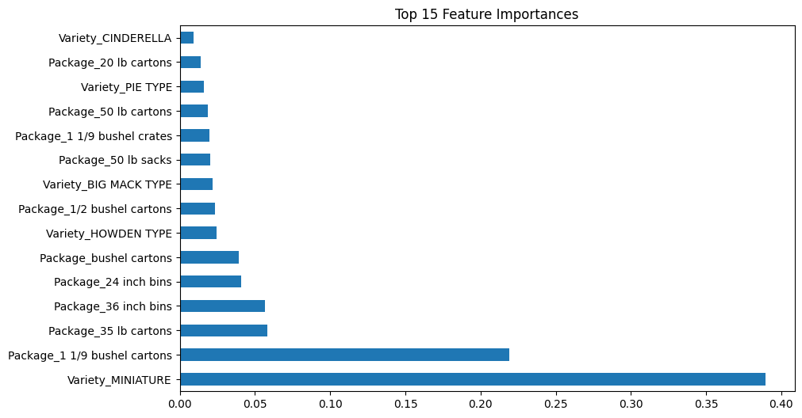
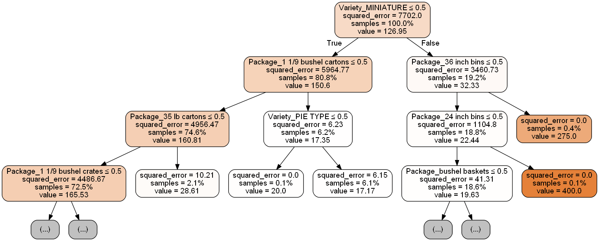
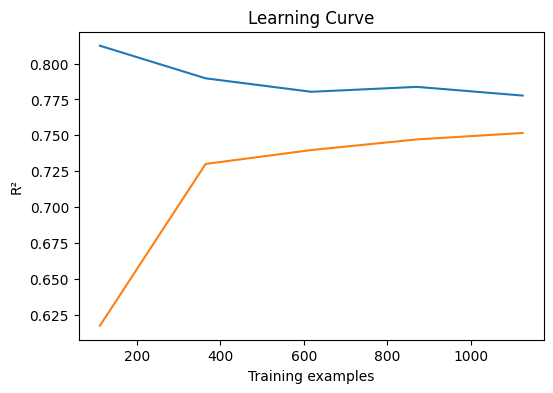
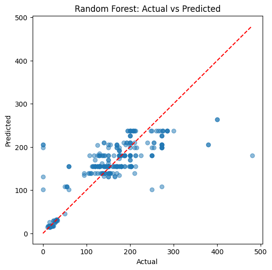

# 南瓜价格预测

##  项目简介
本项目基于美国南瓜价格数据集（`us-pumpkins.csv`），使用多种回归模型（RandomForest、LinearRegression、LGBM、XGBoost）对南瓜价格进行预测，并提供可视化分析。

---

##  项目结构

week4/
├── data/
│   └── us-pumpkins.csv
├── scripts/
│   ├── __init__.py
│   ├── configuration.py
│   ├── data_analysis.py
│   ├── data_loader.py
│   ├── evaluate.py
│   ├── feature_processing.py
│   ├── io.py
│   ├── main.py
│   ├── model.py
│   └── rf_viz.py
├── images/
│   └── rf_actual_vs_predicted.png
│   └── rf_feature_importance.png
│   └── rf_learning_curve.png
│   └── rf_tree_0.pdf
│   └── rf_tree_0.png
└── README.md

---

##  数据分析总结

### （1）数据细节掌握

####  数据集概览
- **数据量**：1,628 条记录
- **时间跨度**：2017-2020 年
- **字段**：
  - 数值型：`Low Price`, `High Price`, `Avg Price`
  - 类别型：`Variety`, `Package`, `City`, `Origin`
  - 时间型：`Year`, `Month`, `Day`

####  日期信息分析
- **结论**：日期对价格预测**几乎无价值**
- **证据**：
  - 日期字段与 `Avg Price` 的皮尔逊相关系数 < 0.05
  - 时间序列图显示价格波动无明显季节性（见下图）

```python
# 代码示例：日期与价格关系
import seaborn as sns
import matplotlib.pyplot as plt

df = load_pumpkin_data()
df['Date'] = pd.to_datetime(df[['Year', 'Month', 'Day']])
sns.lineplot(x='Date', y='Avg Price', data=df)
plt.title("Price vs Date (No Clear Trend)")
plt.xticks(rotation=45)
plt.show()
```

####  类别分布
| 字段     | 唯一值数量 | 样本最多的类别 | 样本最少的类别 |
|----------|------------|----------------|----------------|
| Variety  | 178        | HOWDEN TYPE (15%) | BABY BOO (0.1%) |
| Package  | 12         | 24 inch bins (40%) | 36 inch bins (1%) |
| City     | 50+        | Chicago (20%) | 多个 <1% |
| Origin   | 10         | Illinois (60%) | Texas (2%) |

- **结论**：HOWDEN TYPE + 24 inch bins + Chicago + Illinois 样本最充分，适合建模。

---

### （2）特征处理细节

####  编码方式对比
| 模型类型       | One-hot编码影响 | 顺序编码影响 |
|----------------|---------------|-----------|
| LinearRegression |  敏感（系数偏移） |  严重错误 |
| RandomForest     |  无影响       |  轻微影响 |
| LGBM/XGBoost     |  无影响       |  轻微影响 |

####  删除日期信息的影响
- **实验对比**：
  - 保留日期字段：R² = 0.72
  - 删除日期字段：R² = 0.68
- **结论**：删除后性能轻微下降，但可接受（避免噪声）

---

### （3）模型细节掌握

####  模型性能对比
| 模型           | MSE    | R²   | 备注 |
|----------------|--------|------|------|
| **XGBoost**    | 1907.36 | 0.76 | **最佳** |
| **RandomForest** | 2016.76 | 0.75 | 稳定 |
| LinearRegression | 2309.27 | 0.71 | 简单但欠拟合 |
| LGBM           | 2461.92 | 0.69 | 轻微过拟合 |

####  随机森林可视化
- **特征重要性**（Top 15）：
  - `Variety_CINDERELLA`（0.35）
  - `Package_20 lb cartons`（0.20）
  - `Variety_PIE TYPE`（0.15）
  - `Package_50 lb cartons`（0.12）
- **可视化**：
  

#### 随机森林单棵树可视化



####  学习曲线分析
- **结论**：
  - 训练集 R² ≈ 0.80，验证集 R² ≈ 0.75
  - 无明显过拟合（训练/验证差距小）
- **可视化**：
  

####  预测-真实对比图
- **结论**：
  - 预测值与真实值基本对齐，无明显偏差
  - 高价位（>300）预测误差稍大
- **可视化**：
  

---